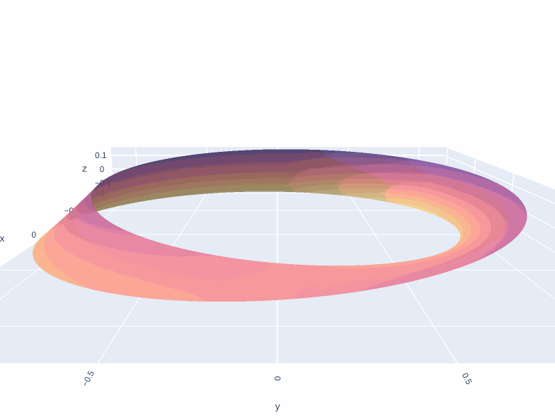

# Möbius Strip Geometry Calculator 🌀

This Python script models a **Möbius strip** using parametric equations and computes two key geometric properties:
- Surface Area
- Edge Length

It also optionally provides a 3D visualization using Plotly.

---

## 📌 Features

- Models a Möbius strip in 3D using parametric equations.
- Calculates:
  -  **Surface Area** (numerically, using integration or approximation)
  -  **Edge Length** (total distance along the strip's continuous edge)
- Customizable parameters: radius (R), width (w), and resolution (n).
- Clean and simplified logic for easy understanding.
- Interactive 3D visualization (optional).

---

## ⚙️ Usage

## 🌐 Try Online (Demo)

👉 **Live Preview**: [https://mobiusstrip.ccbp.tech](https://mobiusstrip.ccbp.tech)  
*(Opens in browser — you can right-click and "Open in new tab")*

## 💻 Run Locally

### 1. Requirements
🛠️ Install dependencies:
```bash
pip install numpy plotly
```
⬇️ Clone the Repository

```bash
git clone https://github.com/sudheerreddysabbella/Python-script-for-Mobius-strip.git
cd Python-script-for-Mobius-strip
```

### 2. Run the Script
```python
from mobius import MobiusStrip

strip = MobiusStrip(R=1.0, w=0.4, n=150)
strip.plot() # Optional 3D visualization (interactive)
print("Surface Area:", strip.compute_surface_area())
print("Edge Length:", strip.compute_edge_length())
```

### 3. Output
- 3D visualization load in the browser
- Surface Area & Edge Length result will diaplay in the terminal

---

## 📊 Output Example
Default Parameters (R=1.0, w=0.4)
- Surface Area: 2.543
- Edge Length: 13.030

Narrow Strip (R=1.0, w=0.2)
- Surface Area: 1.275
- Edge Length: 13.030

Wider Strip (R=1.0, w=0.6)
- Surface Area: 3.824
- Edge Length: 13.030

Larger Radius (R=1.5, w=0.4)
- Surface Area: 3.797
- Edge Length: 19.544


| Parameters | Surface Area | Edge Length |
| :------------ |:---------------:|:-----:|
| Default Parameters (R=1.0, w=0.4) |   2.543   |   13.030   |
| Narrow Strip (R=1.0, w=0.2)       |   1.275   |   13.030   |
| Wider Strip (R=1.0, w=0.6)        |   3.824   |   13.030   |
| Larger Radius (R=1.5, w=0.4)      |   3.797   |   19.544   |

*(Surface area & Edge length are independent of resolution n)*

---

## 📸 Sample ScreenShots

> 360 view of the 3d plot

.png)
> Static image of the 3d plot


> Built-in Continuous Color Scales in Python Plotly

---

## 📐 Parametric Equations
### The Möbius strip is modeled by:
$$
x(u, v) = \left(R + v \cdot \cos\left(\frac{u}{2}\right)\right) \cdot \cos(u)
$$

$$
y(u, v) = \left(R + v \cdot \cos\left(\frac{u}{2}\right)\right) \cdot \sin(u)
$$

$$
z(u, v) = v \cdot \sin\left(\frac{u}{2}\right)
$$

Where:
- u ∈ [0, 2π] — angle around the loop
- v ∈ [-w/2, w/2] — width of the strip
